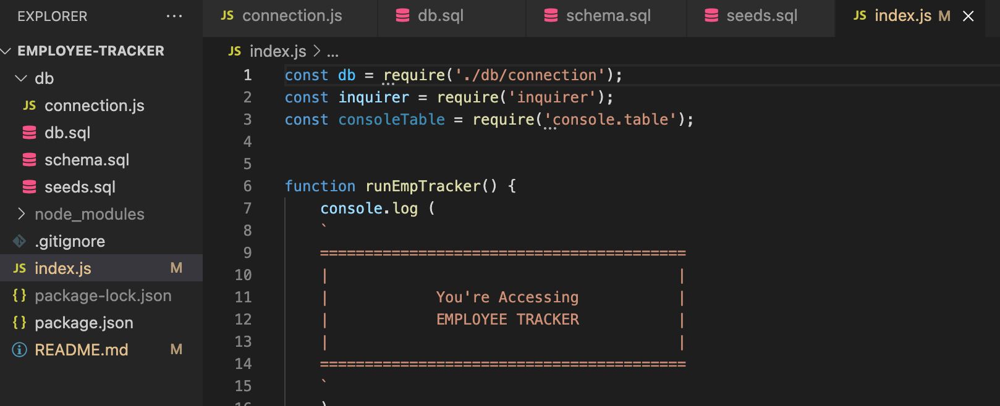
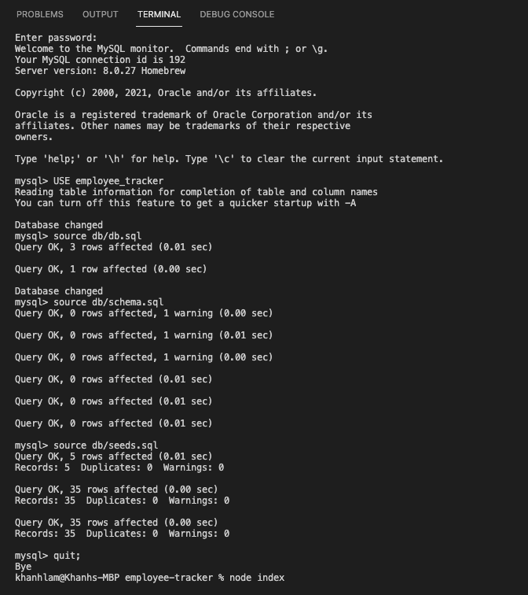
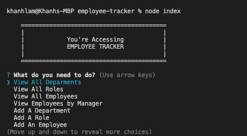
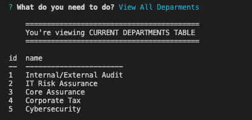
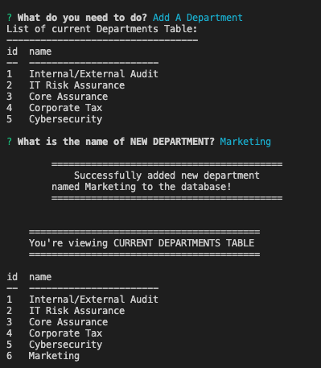
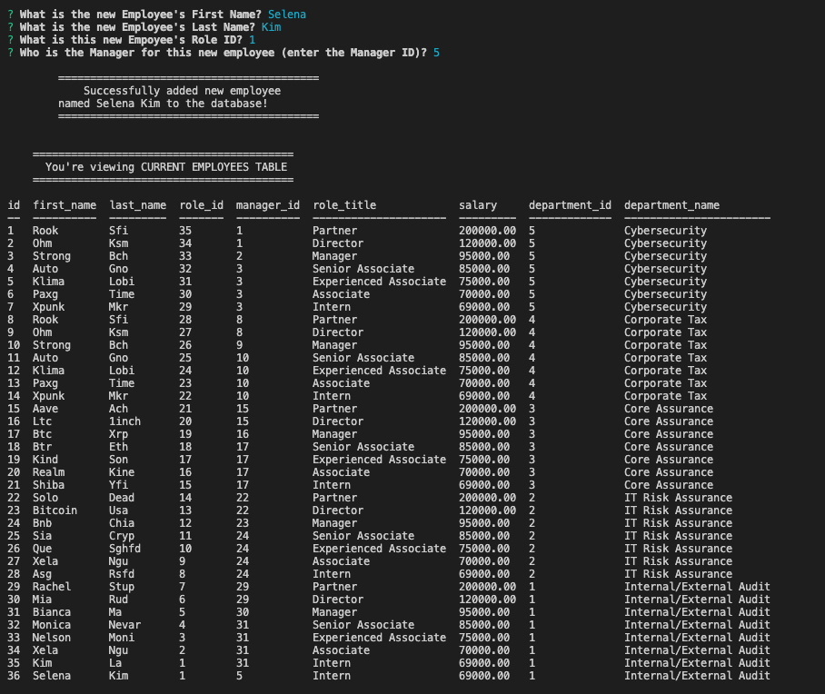
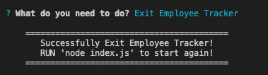

# Employee Tracker

## Description
Developers frequently have to create interfaces that allow non-developers to easily view and interact with information stored in databases. These interfaces are called content management systems (CMS).

This application is to manage a company's employee database, using Node.js, Inquirer, and MySQL.

This project uses the [Inquirer package](https://www.npmjs.com/package/inquirer), [MySQL2 package](https://www.npmjs.com/package/mysql2), and [console.table package](https://www.npmjs.com/package/console.table).

User Story
- AS A business owner
- I WANT to be able to view and manage the departments, roles, and employees in my company
- SO THAT I can organize and plan my business

Acceptance Criteria
- GIVEN a command-line application that accepts user input
- WHEN I start the application
- THEN I am presented with the following options: view all departments, view all roles, view all employees, add a department, add a role, add an employee, and update an employee role
- WHEN I choose to view all departments
- THEN I am presented with a formatted table showing department names and department ids
- WHEN I choose to view all roles
- THEN I am presented with the job title, role id, the department that role belongs to, and the salary for that role
- WHEN I choose to view all employees
- THEN I am presented with a formatted table showing employee data, including employee ids, first names, last names, job titles, departments, salaries, and managers that the employees report to
- WHEN I choose to add a department
- THEN I am prompted to enter the name of the department and that department is added to the database
- WHEN I choose to add a role
- THEN I am prompted to enter the name, salary, and department for the role and that role is added to the database
- WHEN I choose to add an employee
- THEN I am prompted to enter the employee’s first name, last name, role, and manager, and that employee is added to the database
- WHEN I choose to update an employee role
- THEN I am prompted to select an employee to update and their new role and this information is updated in the database

## Table of Contents

* [Installation](#installation)
* [Usage](#usage)
* [License](#license)
* [Contributing](#contributing)
* [Tests](#tests)
* [Questions](#questions)
* [Links](#links)

## Installation

To use this application, please follow the following steps:
- Clone the repository using SSH - 'git clone git@github.com:khanhlam90/employee-tracker.git'
- Run npm to install the inquirer dependencies - 'npm install inquirer'
- Run npm to install the MySQL2 dependencies - 'npm install mysql2'
- Run npm to install the console.table dependencies - 'npm install console.table --save'
- The dabase "employee_tracker" have been created and stored in ./db/db.sql
- Tables and data have been created created and stored in ./db/schema.sql and seeds.sql
- Run mysql -u root -p and enter your password
- Use the database by enter the following in the command line - 'source db/db.sql'
- Create the tables by enter the following in the command line - 'source db/schema.sql'
- Check if the tables have been created successfully by entering the following in the command line - 'SHOW TABLES;'
- Seed the tables data - 'source db/seeds.sql' - Note that users could manually alter the data of the tables in VS code.
- Test the data by trying the following - 'SELECT * FROM employees or roles or departments'
- Exit mysql - quit;

## Usage 
After the installation, please follow:
- Run 'node index.js' or simply 'node index'
- Select options by prompts

- Screenshot of Files Structure Demonstration:

- Screenshot of Command Line MySQL databases:

- Screenshot of running the application in Terminal:

- Screenshot of Viewing All Departments:

- Screenshot of Adding A Department:

- Screenshot of Adding An Employee:

- Screenshot of Existing The Application:

- [Link to the video demonstration of how to run the application](https://drive.google.com/drive/folders/1Oc2k2ySreNb_kmoDX0RURd2IhfojAJ33?usp=sharing)

## License

This project is using the MIT License.

## Contributing

Please feel free to contribute to this project - please find my info at the [Questions](#questions) section and contact me for more infomation.

## Tests

Please refer to [Usage](#usage) section.

## Questions

Please reach me using:

<a href = "mailto:khanhlam1990@yahoo.com"> My Email </a>

[My Github Account](https://github.com/khanhlam90)

## Project Links:
* [Demostration Video](https://drive.google.com/drive/folders/1Oc2k2ySreNb_kmoDX0RURd2IhfojAJ33?usp=sharing)
* [Github Repository](https://github.com/khanhlam90/employee-tracker.git)

